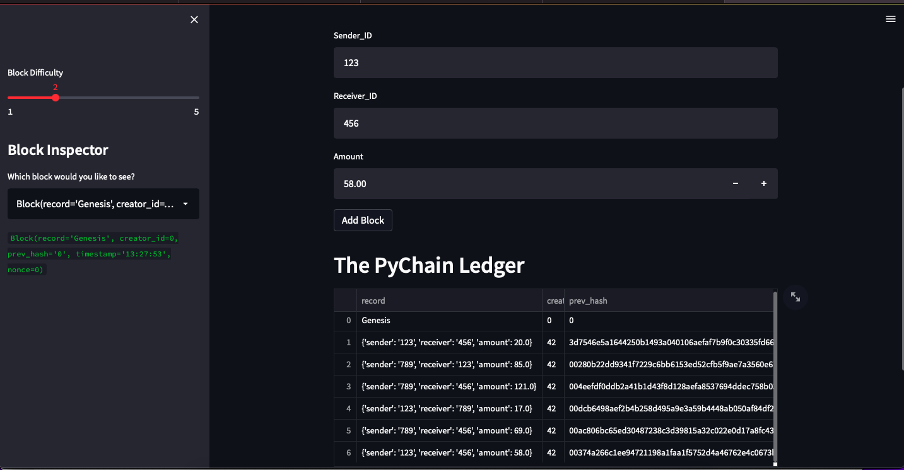

# **Challenge_18**

---

## *This exercise will guide you through a basic code that would create a blovkchain using python libraries*

## Python allows you to add the sender and receiver of a transaction by adding input in the streamlit interface, which will also allow the user to add the amount of the transaction as a float. 

## Illustration of a simple blockchain

